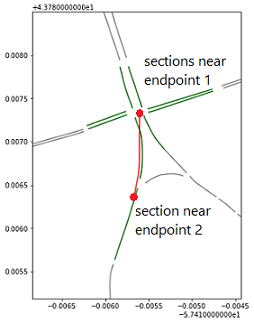

# Match Roads Between Databases
I independantly wrote a program to match roads from different traffic databases using geographic information.
## Problem
My supervisor at the University of Toronto Transportation Research Institute had 2 datasources describing the same roads. One was a traffic simulation model covering the GTHA, the other was traffic flow information from HERE maps. My task was to write an automated program to figure out which road sections in one database, corresponded to those in the other. The problem was compounded by the following:
- over 100,000 road sections per database (strong time complexity requirements)
- alphanumerical naming was inconsistent between databases
- geographic coordinates carried up to 10 metres of uncertainty
- seperate roads often overlapped, making a naive algorithm (matching solely based on distance) inadequate
## Data
Data is given as 2 csv files, were each describes an individual road section.

   
## Architecture
My program consists of the following steps. 
1. Road information is transferred into a new datastructure to allow fast queries based on geographic location.
2. Algorithm matches roads between databases.
3. Statistics and visualizations regarding integrity of matching process is generated.
### Data Reorganization
Linear searching nearby roads gives us N queries and N time per query. Overall this is O(n^2), which is greater than 10^9 and is computationally infeasable. To permit fast queries I restructured our data based on geographic coordinates. I utilized a stack of ordered lists. Locating the appropriate list takes O(1) time, binary searching on that takes O(logN) time. Overall complexity is very roughly O(log(N/L)) time, where L is the number of levels. 

### Algorithm
The same algorithm is applied on every road.
Given the query road (blue), we search for all roads in the alternate database near its endpoints.
All roads on a path connecting these 2 endpoints, while still maintaining a near distance is considered a match. 

### Statistical Visualization

Solution: I independantly designed an algorithm to match roads based on geographic and connected node information. It filtered out sections that overlapped but were not part of the same roadway, as well as sections that were part of the same roadway but ran opposite directions. I made the program generalizable so it could be reapplied to different data sources. Final time to doubly match both databases was 8 minutes.
