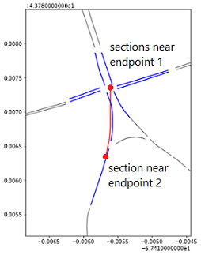
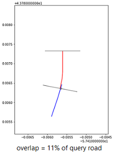

# Match Roads Between Databases
I independantly wrote a program to match roads sections from different traffic databases using geographic information.
## Problem
My supervisor at the University of Toronto Transportation Research Institute had 2 datasources describing the region. One was a traffic simulation model covering the GTHA, the other was traffic flow information from HERE maps. My task was to match road sectinos between each database. Hurdles include the following:
- over 100,000 road sections per database (strong time complexity requirements)
- close proximity does not gaurentee correct match
- geographic coordinates carried up to 10 metres of uncertainty
- 
## Data
Data is given as 2 csv files, with each row containing a section's shapefile and attributes.

   
## Architecture
My program consists of the following stages. 
1. Data reorganization with a new data structure that allows fast queries based on geographic location.
2. Algorithm matches roads between databases.
3. Visualizations and statistics regarding matching process integrity is generated.
### Data Reorganization
In the original Pandas dataframe, searching for a road section based on coordinates is O(N) time. With N queries this gives us O(N^2) time, or roughly 10^9 steps. I restructured key data into a stack of ordered lists, which allows for binary search (figure below). Each query takes approximately O(log(N/nl)) time, where nl = number of lists = 8000. This runs in roughly 5*10^6 steps.

### Matching Algorithm
For every query road in dataframe 1, we will find matching roads in dataframe 2. Unfortunately there are many sections that are close or overlap, but do not belong to the same road. Therefore we need a better algorithm than a simple distance heuristic. The solution consists of the following:

Step 1: Find sections near the endpoints of the query road, and store them in 2 sets.

Step 2: Remove sections that do not directly connect the endpoints (approximated by the 2 sets). Remaining sections are the final matches.

### Statistical Visualization
Finally, the overlapping distance and direction of each matched section in relation to the query road is generated using simple geometry heuristics. Visualizations are produced to test program integrity.

## Results

