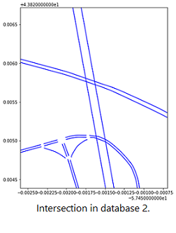

# Match Roads Between Databases
I independantly wrote a program to match roads sections from different traffic databases using geographic information.
## Problem
My supervisor at the University of Toronto Transportation Research Institute had 2 datasources describing the region. One was a traffic simulation model covering the GTHA, the other was traffic flow information from HERE maps. My task was to match road sectinos between each database. Hurdles include the following:
- over 100,000 road sections per database (strong time complexity requirements)
- close proximity does not gaurentee correct match
- geographic coordinates carried up to 10 metres of uncertainty
- 
## Data
Data is given as 2 csv files, with each row describing an individual road section.

   
## Architecture
My program consists of the following stages. 
1. Data reorganization with a new data structure that allows fast queries based on geographic location.
2. Algorithm matches roads between databases.
3. Visualizations and statistics regarding matching process integrity is generated.
### Data Reorganization
In the original Pandas dataframe, searching for a road section based on coordinates is O(N) time. With N queries this gives us O(N^2) time, or roughly 10^9 steps. I restructured key data into a stack of ordered lists, which allows for binary search (figure below). Each query takes approximately O(N\*log(N/nl)) time, where nl = number of lists = 8000. This runs in roughly 4*10^6 steps.

### Algorithm
The same algorithm is applied on every road.
Given the query road (blue), we search for all roads in the alternate database near its endpoints.
All roads on a path connecting these 2 endpoints, while still maintaining a near distance is considered a match. 

### Statistical Visualization

Solution: I independantly designed an algorithm to match roads based on geographic and connected node information. It filtered out sections that overlapped but were not part of the same roadway, as well as sections that were part of the same roadway but ran opposite directions. I made the program generalizable so it could be reapplied to different data sources. Final time to doubly match both databases was 8 minutes.

